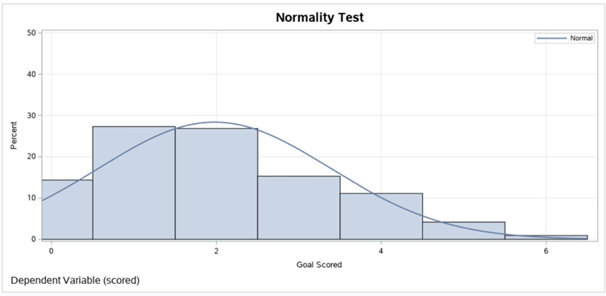
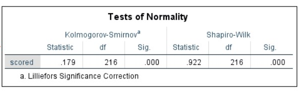
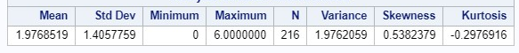
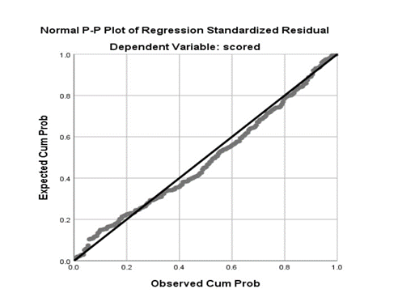
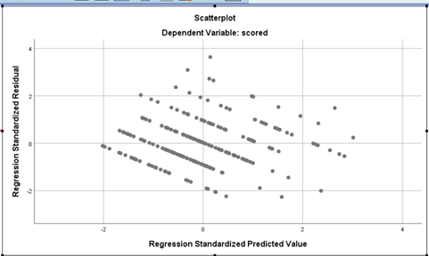
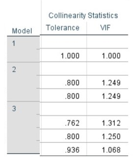
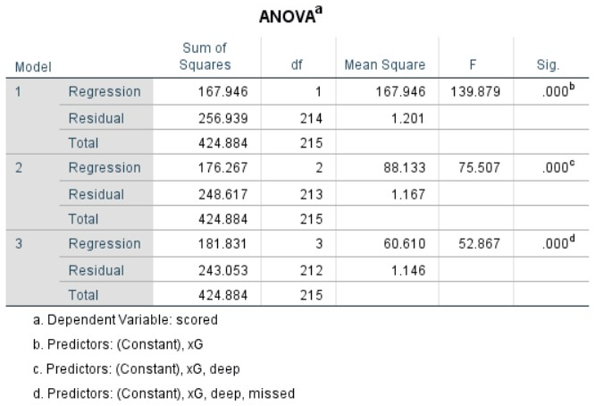
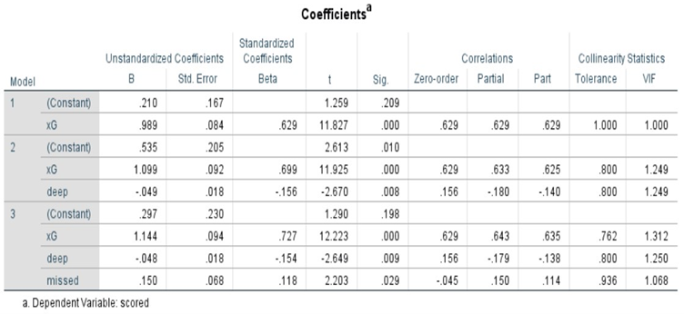

# Multivariate-Data-Analysis
Using dataset from kaggle dataset 'Football Data: Expected Goals and Other Metrics' and utilize SPSS to find which metrics is significant to improve goal scoring output. Technique used in this analysis included Stepwise Multiple Linear Regression (including ANOVA, homoscedasticity & multicollinearity test) to establish causal relationship between dependent and independent variable. Then Factor Analysis technique (correlation metric, PCA, Varimax) to reduce dimension of independent variable.
  
Dataset Link : https://www.kaggle.com/slehkyi/extended-football-stats-for-european-leagues-xg
## Multivariate Normality
Normality of the error term distribution
 
 
 

  
## Linear relationship 
where it assumes there is linear relationship between independent variable and dependent variable
 

  
## Homoscedasticity (equal variance) 
Constant variance of the error terms where it assume of error term are similar across the value of independent variable
 

  
## Minimum Multicollinearity 
Independence of the error term where it assumes that all independent variable are not highly correlated with each other 
 

  
## Analysis of Variance (ANOVA) 
Determine whether there are any statistically significant differences between the means of three groups.
 

  
## Coefficients of Regression 
Y = 0.210+0.989X1-0.049X2+0.150X3
+ Y=Goal scored against opponent (scored)
+ X1=Expected Goal (xG)
+ X2= Passes completed within an estimated 20 yards of goal (deep)
+ X3= Number of goals missed in games (missed)

 
